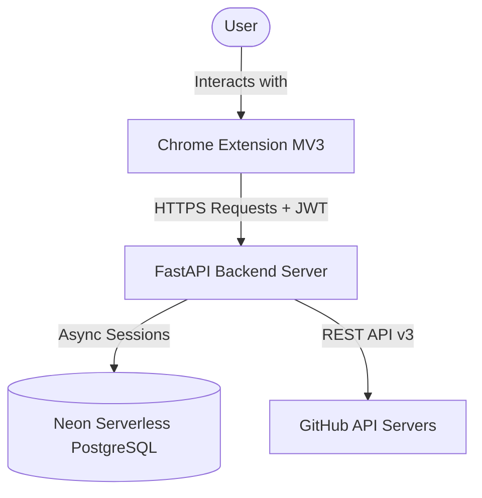

# CodeSync System Architecture

This document details the high-level topology, data models, and detailed sequence interactions between the CodeSync Chrome Extension, the FastAPI backend, the Neon PostgreSQL database, and the GitHub REST API.

---

## High-Level System Topology

The diagram below shows the high-level physical and logical boundaries of the system:



---

## 1. Authentication Flow (GitHub OAuth)

CodeSync uses GitHub OAuth to authorize user profiles. Upon success, the backend returns a custom JWT to authorize subsequent API queries.

```mermaid
sequence diagram
    autonumber
    actor User
    participant Extension as Extension Popup / Options
    participant Backend as FastAPI Backend
    participant GitHub as GitHub OAuth

    User->>Extension: Click "Login with GitHub"
    Extension->>Backend: GET /auth/github/login
    Backend-->>Extension: Returns authorization_url & state
    Extension->>User: Redirects to GitHub Login URL in new tab
    User->>GitHub: Approves access scopes (repo, user:email)
    GitHub->>Backend: Redirect callback (code, state) to callback endpoint
    Backend->>GitHub: Exchanges authorization code for Access Token
    GitHub-->>Backend: Returns GitHub Access Token
    Backend->>Backend: Encrypts token and stores/registers User in DB
    Backend->>Backend: Generates CodeSync JWT (sub: user_id)
    Backend-->>User: Renders JSON callback response containing JWT
    User->>Extension: Paste JWT manually (DEV_MODE)
    Extension->>Extension: Stores JWT in chrome.storage.local
```

---

## 2. Repository Provisioning & Bootstrapping

Repository provisioning connects a user account to a designated target repository on GitHub. If the repository does not exist on GitHub, the backend creates it and initializes its layout.

```mermaid
graph TD
    Start[POST /repositories/create] --> CheckDB{Exists in Local DB?}
    
    CheckDB -->|Yes| CheckGitHub{Exists on GitHub?}
    CheckDB -->|No| CreateGitHub[Provision repository on GitHub]
    
    CheckGitHub -->|Yes| ReturnExisting[Return metadata details]
    CheckGitHub -->|No| CreateGitHub
    
    CreateGitHub --> SaveDB[Save repository record in DB with BootstrapStatus.PENDING]
    SaveDB --> StartBootstrap[Trigger async bootstrap pipeline]
    
    subgraph Bootstrapping Lifecycle
        StartBootstrap --> SetRunning[Set status to RUNNING]
        SetRunning --> WriteGitignore[Commit .gitignore on GitHub]
        WriteGitignore --> WriteReadme[Commit README.md on GitHub]
        WriteReadme --> WriteConfig[Commit metadata/config.json on GitHub]
        WriteConfig --> SetCompleted[Set status to COMPLETED & record timestamp]
    end
    
    SetCompleted --> End[Return response details]
    
    style Bootstrapping Lifecycle fill:#1e1e30,stroke:#6366f1,stroke-width:2px
```



---

## 3. LeetCode Challenge Detection Flow

This cycle runs in the browser extension to detect coding challenge pages and parse their metadata.

```mermaid
sequence diagram
    autonumber
    participant Page as LeetCode Web Page
    participant Content as Content Script (content_detect.js)
    participant Worker as Background Service Worker
    participant Storage as chrome.storage.local
    participant Popup as Extension Popup UI

    Page->>Content: Page finishes loading
    Content->>Content: Verify path matches "/problems/*"
    Content->>Page: Parse DOM for Slug, Title, and Difficulty
    Content->>Content: Perform validation checks (non-empty fields)
    Content->>Worker: Send message "PROBLEM_DETECTED" + metadata
    Worker->>Storage: Persist payload as "current_problem"
    Worker->>Worker: Update extension badge based on difficulty (E/M/H)
    Storage-->>Popup: onChanged event triggers update
    Popup->>Popup: Dynamically re-renders "Current Problem" panel
```

---

## 4. Problem Solution Synchronization Flow

Once a problem is detected and a submission is finalized, the solution is synchronized (committed) to the repository.

```mermaid
graph TD
    Sub[Solution Submission] --> VerifyOwner[Verify target repository ownership]
    VerifyOwner --> CreateSync[Create SyncHistory record with PENDING status]
    CreateSync --> SetSyncRunning[Set status to RUNNING]
    SetSyncRunning --> GenPaths[Generate folder structure paths]
    GenPaths --> CheckReadme{Check if README exists on GitHub}
    
    CheckReadme -->|Yes| UpdateReadme[Update README on GitHub]
    CheckReadme -->|No| CreateReadme[Commit new README on GitHub]
    
    UpdateReadme --> CheckCode{Check if solution file exists on GitHub}
    CreateReadme --> CheckCode
    
    CheckCode -->|Yes| UpdateCode[Update solution file on GitHub]
    CheckCode -->|No| CreateCode[Commit new solution file on GitHub]
    
    UpdateCode --> SaveMeta[Capture GitHub commit URL and SHA]
    CreateCode --> SaveMeta
    
    SaveMeta --> SetSyncCompleted[Set status to COMPLETED in database]
    
    style Bootstrapping Lifecycle fill:#1e1e30,stroke:#6366f1,stroke-width:2px
```


