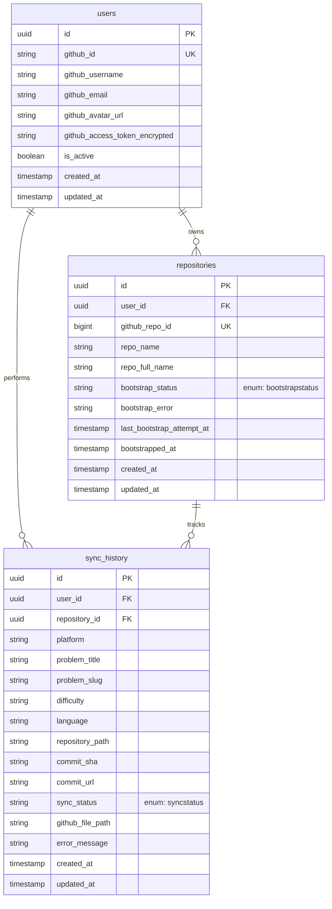

# CodeSync Database Documentation

This document covers our database schemas, tables, indices, unique constraints, enums, and entity relationships.

---

## Entity Relationship Diagram (ERD)

The relationship diagram below shows how tables are connected in PostgreSQL:

---

## Table Specifications

### 1. `users`
Represents GitHub authorized developer profiles:

- **Columns**:
  - `id`: `Uuid` (Primary Key).
  - `github_id`: `String(100)` (Unique, Index, nullable=False). Unique profile ID from GitHub.
  - `github_username`: `String(100)` (nullable=False).
  - `github_email`: `String(255)` (nullable=True).
  - `github_avatar_url`: `String(500)` (nullable=True).
  - `github_access_token_encrypted`: `String(500)` (nullable=False). AES-encrypted oauth token.
  - `is_active`: `Boolean` (Default `True`, nullable=False).
  - `created_at` / `updated_at`: `DateTime(timezone=True)`.
- **Relationships**:
  - `repositories`: Has-many relationship mapping to `repositories`.
  - `sync_history`: Has-many relationship mapping to `sync_history`.

---

### 2. `repositories`
Represents GitHub repository items provisioned for synchronizations:

- **Columns**:
  - `id`: `Uuid` (Primary Key).
  - `user_id`: `Uuid` (ForeignKey mapping to `users.id`, nullable=False, Index). Uses `ondelete="CASCADE"`.
  - `github_repo_id`: `BigInteger` (Unique, Index, nullable=False).
  - `repo_name`: `String(100)` (nullable=False).
  - `repo_full_name`: `String(255)` (nullable=False).
  - `bootstrap_status`: `SQLEnum` (`pending`, `running`, `completed`, `failed`, default `pending`, nullable=False, Index). Matches custom PostgreSQL enum `bootstrapstatus`.
  - `bootstrap_error`: `Text` (nullable=True). Captures up to 2000 chars of bootstrap exceptions.
  - `last_bootstrap_attempt_at`: `DateTime(timezone=True)` (nullable=True).
  - `bootstrapped_at`: `DateTime(timezone=True)` (nullable=True).
  - `created_at` / `updated_at`: `DateTime(timezone=True)`.
- **Relationships**:
  - `user`: Maps back to the owner `User` entity.
- **Constraints**:
  - Unique constraint on `(user_id, repo_name)` to prevent double registration.

---

### 3. `sync_history`
Tracks the history of coding solutions synchronized to GitHub:

- **Columns**:
  - `id`: `Uuid` (Primary Key).
  - `user_id`: `Uuid` (ForeignKey to `users.id`, nullable=False, Index). Uses `ondelete="CASCADE"`.
  - `repository_id`: `Uuid` (ForeignKey to `repositories.id`, nullable=False, Index). Uses `ondelete="CASCADE"`.
  - `platform`: `String(50)` (Default `leetcode`, nullable=False).
  - `problem_title`: `String(255)` (nullable=False).
  - `problem_slug`: `String(255)` (nullable=False, Index).
  - `difficulty`: `String(50)` (nullable=False).
  - `language`: `String(50)` (nullable=False).
  - `repository_path`: `Text` (nullable=True).
  - `commit_sha`: `String(100)` (nullable=True).
  - `commit_url`: `String(500)` (nullable=True).
  - `sync_status`: `SQLEnum` (`pending`, `running`, `completed`, `failed`, default `pending`, nullable=False, Index). Mapped to custom PostgreSQL enum `syncstatus`.
  - `github_file_path`: `Text` (nullable=True).
  - `error_message`: `Text` (nullable=True). Captures up to 2000 chars of failure logs.
  - `created_at` / `updated_at`: `DateTime(timezone=True)`.
- **Relationships**:
  - `user`: Maps back to the executing `User` entity.
  - `repository`: Maps back to target `Repository` workspace.
- **Constraints & Indices**:
  - Unique constraint `uq_sync_history_repo_slug_lang` on `(repository_id, problem_slug, language)` to prevent duplicate solution syncs.
